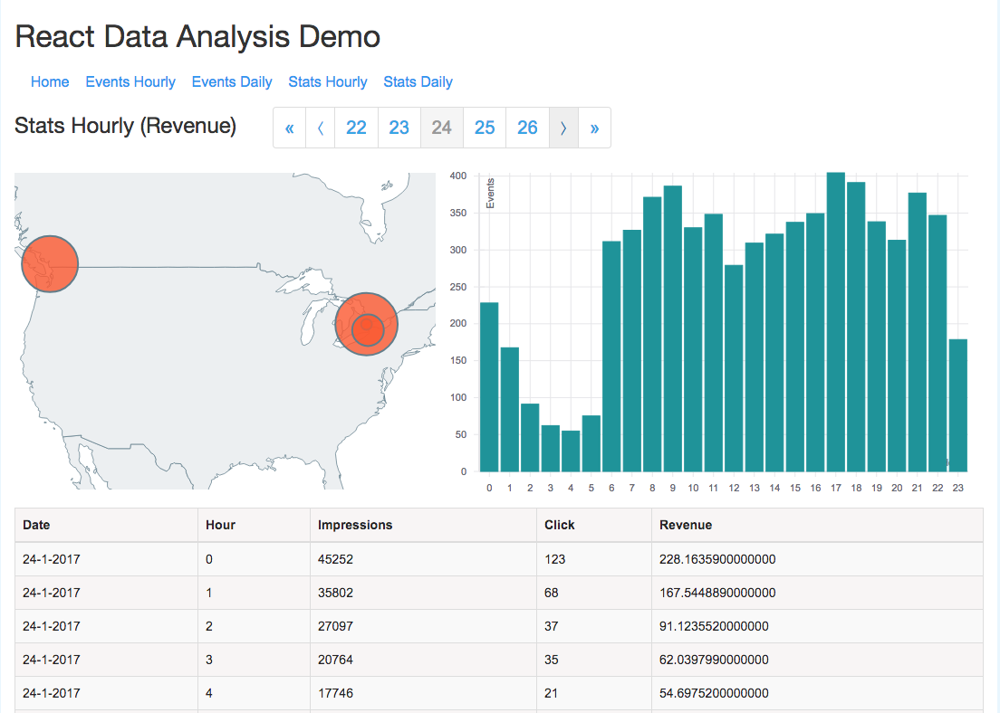

# React Data Analysis Demo

## Description of the application
This is an example of data analysis and visualization using React with live feed from a PostgreSQL database.
There are two sets of daily time series data and two sets of hourly time series data. The latter two also include locations.
To simulate a production environment, rate limiting is set on API requests to events/daily: the maximum of 5 requests during the period of 10 seconds is allowed from a specific IP address.

Here is a screenshot of one of the pages:

  

## Instructions on installation and running
The code is split into two parts:
- server-side (in the `server` folder)
- client-side (in the application root folder)
The application needs both the server and the client to run concurrently. In the development environment this is achieved by running the two in separate terminal windows.

### Server
- Change to the `server` directory
- run `npm install` to install dependencies
- run `npm run dev` to run the server at http://localhost:5555/

### Client
- Change to the application root directory
- run `npm install` to install dependencies
- run `npm run dev` to run the client at http://localhost:8080/
